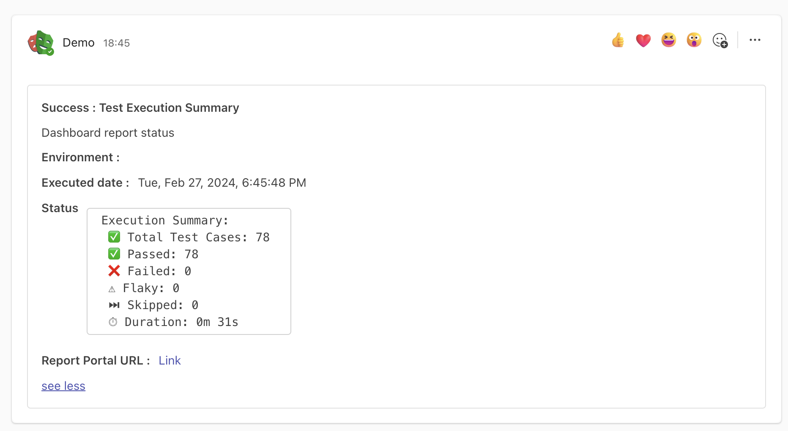

# Playwright Project MS Team webhook Notification

This repository serves as an example of how to integrate Report Portal and MS Teams webhook notifications in a Playwright testing environment.



## Project Structure

The project is structured as follows:

- `.github/workflows/playwright.yml`: This file contains the GitHub Actions workflow for running Playwright tests.
- `playwright.config.ts`: This file contains the configuration for Playwright tests.
- `tests/`: This directory contains the test files.
- `utils/report/`: This directory contains the files for sending notifications to MS Teams.

## Key Features

- **Report Portal Integration**: This project is configured to send test results to Report Portal.
- **MS Teams Notifications**: The [`NotificationSender`](utils/report/notificationSender.ts) class in `utils/report/notificationSender.ts` is used to send notifications to MS Teams.

## Setup

1. Clone the repository.
2. Run `npm install` to install the dependencies.
3. Set up your Report Portal and MS Teams webhook configurations.
4. Run the tests with `npx playwright test`.

## Report Portal Configuration

The project is configured to send test results to Report Portal. The configuration is located in the `playwright.config.ts` file:

```typescript
export const RPconfig = {
  apiKey: 'Your_Report_Portal_API_Key',
  endpoint: 'Your_Report_Portal_Endpoint',
  project: 'Your_Report_Portal_Project_Name',
  launch: process.env.RPlaunchName,
  attributes: [
    {
      key: 'attributeKey',
      value: 'attrbiuteValue',
    },
    {
      value: 'anotherAttrbiuteValue',
    },
  ],
  includeTestSteps: true,
  uploadTrace: true,
  description: process.env.URL,
};
```
Replace the placeholders with your actual Report Portal details:

- `apiKey`: Your Report Portal API key.
- `endpoint`: The URL of your Report Portal server.
- `project`: The name of your Report Portal project.
- `launch`: The name of your test launch. This is read from the `RPlaunchName` environment variable.
- `attributes`: An array of attributes to be attached to the launch.
- `includeTestSteps`: If set to true, test steps will be included in the report.
- `uploadTrace`: If set to true, trace files will be uploaded to Report Portal.
- `description`: The description of the launch. This is read from the `URL` environment variable.


## MS Teams Notifications Setup

To set up MS Teams notifications, you need to create an Incoming Webhook in MS Teams and use it in your project:

1. Go to the channel where you want to receive the notifications.
2. Click on the three dots (...) next to the channel name and select "Connectors".
3. Search for "Incoming Webhook" and click "Configure".
4. Provide a name and upload an image for your webhook, then click "Create".
5. Copy the webhook URL provided by Microsoft Teams.
6. Replace `'YOUR_WEBHOOK_URL'` in the `sendNotification` function in `utils/report/notificationSender.ts` with the webhook URL you got from Microsoft Teams.

Notifications are sent to MS Teams at the end of each test. The notifications include a summary of the test results. This is handled by the [`SummaryReport`](utils/report/summaryReport.ts) class in `utils/report/summaryReport.ts`.

## Contributing

Contributions are welcome. Please open an issue or submit a pull request.

## License

This project is licensed under the ISC license.